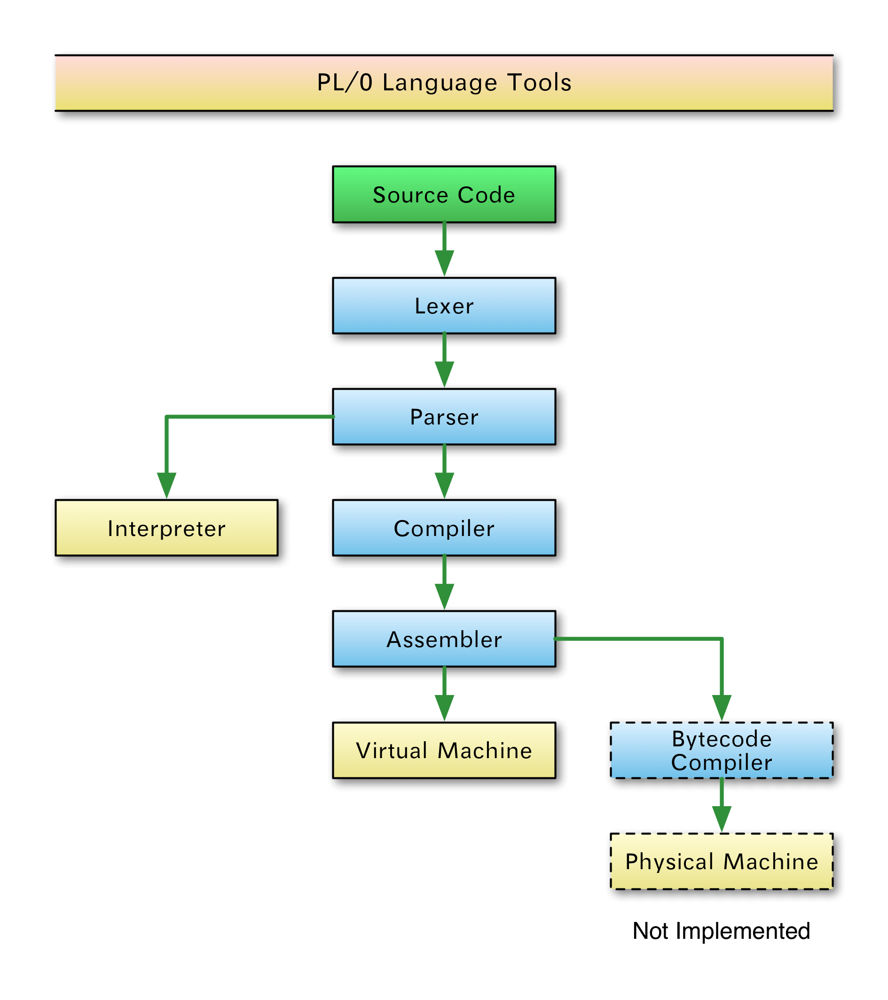

# PL/0 Language Tools

The PL/0 Language Tools serve as an example of how to construct a
compiler. The language [PL/0](https://en.wikipedia.org/wiki/PL/0) was
originally introduced in the book "Algorithms + Data Structures = Programs",
by Niklaus Wirth in 1975.

This project includes a full stack of tools designed for educational
purposes to learn about compilers, interpreters and virtual machines.
Each component can be executed independently and is typically between
100-300 lines of code.

It is designed to be clear and concise at the expense of performance. It
is easy to extend and modify, e.g. adding new syntax constructs or
machine instructions.

## Install dependencies

* The [ply](https://www.dabeaz.com/ply/) Python library is used for lexical analysis and parsing.

### Fedora

	dnf install -y python-ply

### Debian/Ubuntu

	apt update && apt install -y python-is-python3 python3-ply

### Unix-based

Package names may be similar to the ones above.

For macOS it is possible to use the [Homebrew](https://brew.sh/) installer.

### Windows

Open a Command Prompt (press Win + R, type `cmd`) and install Python.

	winget install Python

Use [pip](https://pip.pypa.io/) to install the ply library.

	pip install ply

## Basic Usage

Here is a full example using the interpreter:

	$ python pl0_interpreter.py < examples/fibonacci.pl0
	1
	1
	2
	3
	5
	8
	13
	21
	34
	55
	89
	144
	233
	377
	610
	987
	1597
	2584
	4181
	6765
	10946
	-- Stack Frame --
	Constants: {'K': 20}
	Variables: {'m': 17711, 'n': 28657, 'k': 17711, 'count': 21}
	Procedures: {}

Example of using the compiler, assembler and virtual machine:

	$ python pl0_compiler.py < examples/fibonacci.pl0 | python pl0_assembler.py | python pl0_machine.py
	1
	1
	2
	3
	5
	8
	13
	21
	34
	55
	89
	144
	233
	377
	610
	987
	1597
	2584
	4181
	6765
	10946
	-- Machine State --
	Sequence: [16, 6, 17711, 28657, 17711, 21, 10, 1, 7, 2, 10, 1, 7, 3, 10, 1, 7, 4, 10, 0, 7, 5, 6, 5, 10, 20, 31, 22, 57, 6, 4, 50, 11, 6, 3, 7, 4, 6, 2, 6, 3, 45, 7, 3, 6, 4, 7, 2, 6, 5, 10, 1, 45, 7, 5, 16, 22, 1]
	Stack: []
	Offset: -1

If you want to see a abstract syntax tree of your program, use the pl0_graphviz.py command:

	./pl0_graphviz.py < examples/fibonacci.pl0

A sample graph is included in the `examples` directory.

For more advanced usage, including documentation on individual components, please see the [online documentation](http://programming.dojo.net.nz/study/pl0-language-tools/index).

## Cross Compiling

Recent development adds several new compiler targets. I'm interested in the possibility of cross compiling PL/0 to other languages; most of my work on this targets this.

I (Charles) am working on cross compilers for several stack based languages, including Retro, Parable, and ANS FORTH.

## License

Copyright, 2012, by Samuel G. D. Williams. <http://www.codeotaku.com>  
Copyright, 2012, by Michal J Wallace. <http://www.michaljwallace.com/>  
Copyright, 2012, 2016, 2017 by Charles Childers <http://forthworks.com/>  

Permission is hereby granted, free of charge, to any person obtaining a copy
of this software and associated documentation files (the "Software"), to deal
in the Software without restriction, including without limitation the rights
to use, copy, modify, merge, publish, distribute, sublicense, and/or sell
copies of the Software, and to permit persons to whom the Software is
furnished to do so, subject to the following conditions:

The above copyright notice and this permission notice shall be included in
all copies or substantial portions of the Software.

THE SOFTWARE IS PROVIDED "AS IS", WITHOUT WARRANTY OF ANY KIND, EXPRESS OR
IMPLIED, INCLUDING BUT NOT LIMITED TO THE WARRANTIES OF MERCHANTABILITY,
FITNESS FOR A PARTICULAR PURPOSE AND NONINFRINGEMENT. IN NO EVENT SHALL THE
AUTHORS OR COPYRIGHT HOLDERS BE LIABLE FOR ANY CLAIM, DAMAGES OR OTHER
LIABILITY, WHETHER IN AN ACTION OF CONTRACT, TORT OR OTHERWISE, ARISING FROM,
OUT OF OR IN CONNECTION WITH THE SOFTWARE OR THE USE OR OTHER DEALINGS IN
THE SOFTWARE.
